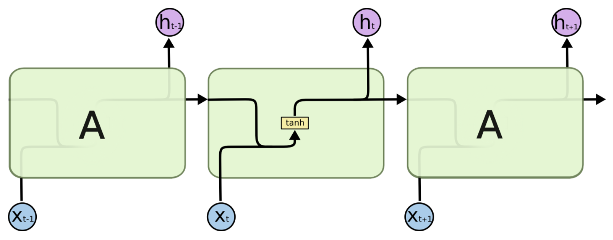
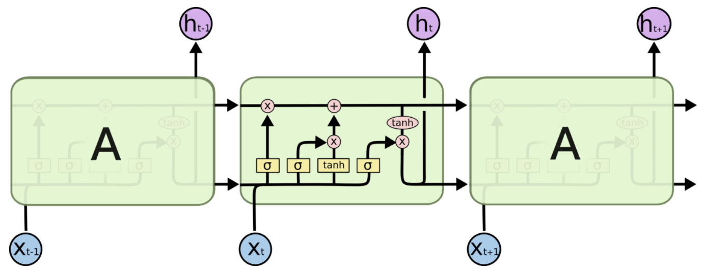
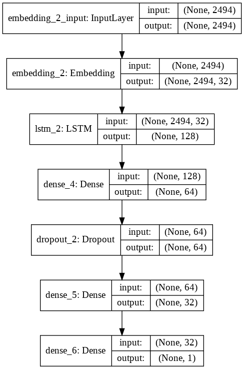
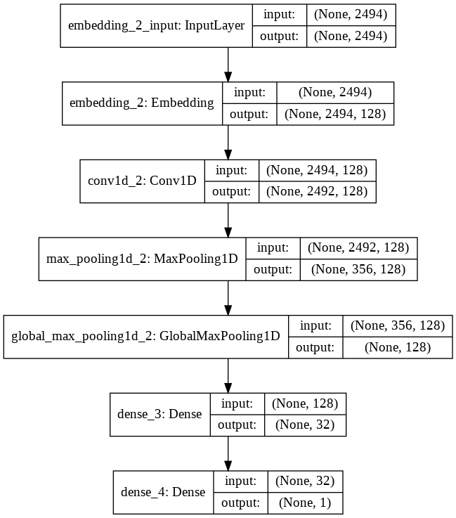

<h1>IMDB Sentiment Analysis Model</h1>

This is a Sentiment Analysis Model built using Machine Learning and Deep Learning to classify movie reviews from the IMDB dataset into "positive" and "negative" classes.

<h3> TABLE OF CONTENTS </h3>
<ol type="I">
    <li><a href="#intro"> Introduction </a></li>
    <li><a href="#dataset"> Dataset </a></li>
    <li><a href="#models"> Models </a></li>
        <ol type="i">
            <li><a href="#lstm"> Long Short-Term Memory Network </a></li>
            <li><a href="#convnet"> Convolutional Network </a></li>
        </ol>
    </li>
    <li><a href="#frameworks"> Frameworks, Libraries & Languages </a></li>
    <li><a href="#usage"> Usage </a></li>
    <li><a href="#acknowledgement"> Acknowledgement </a></li>
</ol>

<h2 id="intro">Introduction</h2>

Sentiment Analysis has been a classic field of research in Natural Language Processing, Text Analysis and Linguistics. It essentially attempts to identify, categorize and possibly quantify, the opinions expressed in a piece of text and determine the author's attitude toward a topic, product or situation. This has widespread application in Recommender systems for predicting the preferences of users and in e-commerce websites to analyse customer feedback & reviews. Based on the sentiments extracted from the data, companies can better understand their customers and align their businesses accordingly.  
Before the advent of the Deep Learning era, Statistical methods and Machine Learning techniques found ample usage for Sentiment Analysis tasks. With the increase in the size of datasets and text corpora available on the internet, coupled with advancements in GPUs and computational power available for these tasks, Neural Networks have ushered in and vastly improved the state-of-the-art performance in various NLP tasks, and Sentiment Analysis remains no exception to this. Recurrent Neural Networks (RNN), Gated RNNs, Long-Short Term Memory networks (LSTM) and 1D ConvNets are some classic examples of neural architectures which have been successful in NLP tasks.  

<h2 id="dataset"> Dataset </h2>

This project uses the <a href="https://ai.stanford.edu/~amaas/data/sentiment/">Large Movie Review Dataset</a> which has been in-built with Keras. This dataset contains 25000 highly polar movie reviews for training, and another 25000 reviews for testing. It does not contain more than 30 reviews for any single movie, and also ensures there are equal number of positive and negative reviews in the both the training and test sets. Additionally, neutral reviews (those with rating 5/10 or 6/10) have been excluded.  
This dataset has been a benchmark for many Sentiment Analysis tasks, since it was first released in 2011.

<h2 id="models">Models</h2>

    I built and experimented with different models to compare their performance on the dataset -

<ul>
    <li>
        <h4 id="lstm"><b> Long Short-Term Memory Network: </b></h4>
        

            Recurrent Neural Networks are especially suited for sequential data (sequence of words in this case). Unlike the more common feed-forward neural networks, an RNN does not input an entire example in one go. Instead, it processes a sequence element-by-element, at each step incorporating new data with the information processed so far. This is quite similar to the way humans too process sentences - we read a sentence word-by-word in order, at each step processing a new word and incorporating it with the meaning of the words read so far.
        

        

            <figure>
                
                <figcaption>
                    A diagram of a recurrent neural network
                </figcaption>
            </figure>
        

        

            <figure>
                
                <figcaption>
                    A diagram of an LSTM network.
                </figcaption>
            </figure>
        

        

            LSTMs further improve upon these vanilla RNNs. Although theoretically RNNs are able to retain information over many time-steps ago, practically it becomes extremely difficult for simple RNNs to learn long-term dependencies, especially in extremely long sentences and paragraphs. LSTMs have been designed to have special mechanisms to allow past information to be reutilised at a later time. As a result, in practise, LSTMs are almost always preferable over vanilla RNNs.  
            Here, I built an LSTM model using Keras Sequential API. A summary of the model and its layers is given below. The model was trained with a batch size of 64, using the Adam Optimizer.
        

        

            <figure>
                
                <figcaption> A plot of the model and its layers </figcaption>
            </figure>
        

        

            While tuning the hyper-parameters, a Dropout layer was introduced as measure of regularization to minimize the overfitting of the model on the training dataset. A separate validation set (taken from the training data) was used to check the performance of the model during this phase.  
            This model managed to achieve an accuracy of <b>85.91%</b> when evaluated on the hidden test dataset (and <b>99.96%</b> on the training dataset).
        

    </li>
    <li>
        <b><h4 id="convnet">Convolutional Network:</h4></b>
        

            The idea of Convolutional Networks has been quite common in Computer Vision. The use of convolutional filters to extract features and information from pixels of an image allows the model to identify edges, colour gradients, and even specific features of the image like positions of eyes & nose (for face images). Apart from this, 1D Convolutional Neural Networks have also proven quite competitive with RNNs for NLP tasks. Given a sequential input, 1D CNNs are well able to recognize and extract local patterns in this sequence. Since the same input transformation is performed at every patch, a pattern learned at a certain position in the sequence can very easily later be recognized at a differnt position.
            Further, in comparison to RNNs, ConvNets in general are extremely cheap to train computationally - In the current project (built using Google Colaboratory with a GPU kernel), the LSTM model took more than 30 minutes to complete an epoch (during training) while the CNN model took hardly 9 seconds on average!
                
            I built the model using Keras Sequential API. A summary of the model and its layers is below.
        

        

            <figure>
                
                <figcaption> A plot of the model and its layers </figcaption>
            </figure>
        

        

            This model was trained with a batch size of 64 using Adam Optimizer. The best model (weights and the architecture) was saved during this phase.
            This model achieved an accuracy of <b>89.7 %</b> on the test dataset, a good increase over the LSTM model.
        

    </li>
</ul>

<h2 id="frameworks">Frameworks, Libraries & Languages</h2>
<ul>
    <li> Keras </li>
    <li> Tensorflow </li>
    <li> Python3 </li>
    <li> Matplotlib </li>
</ul>

<h2 id="usage">Usage</h2>

 On the terminal run the following commands- 

    <ol>
        <li>
            Install all dependencies
             
            <code> pip install python3 </code>
             
            <code> pip install matplotlib </code>
             
            <code> pip install tensorflow </code>
             
            <code> pip install keras </code>
        </li>
        <li>
            Clone this repository on your system and head over to it
             
              <code> git clone https://github.com/matakshay/IMDB_Sentiment_Analysis </code>
             
            <code size> cd IMDB_Sentiment_Analysis </code>
        </li>
        <li>
            Either of the CNN or LSTM model can be used to predict for a custom movie review.  
            To run the LSTM model -
             
                <code> python3 LSTM_predict.py </code>
             
            This loads the LSTM model with its weights and prompts for an input.       
              
            To run the CNN model -
             
                <code> python3 CNN_predict.py </code>
             
            This loads the CNN model with its weights and prompts for an input.
        </li>
        <li>
            Type a movie review (in English) in the terminal and get its sentiment class predicted by the model
        </li>
    </ol>
    
<h2 id="acknowledgement">Acknowledgement</h2>

    I studied and referred many articles, books and research papers while working on this project. I am especially grateful to the authors of the following for their work -

    <ul>
        <li> https://colah.github.io/posts/2015-08-Understanding-LSTMs/ </li>
        <li> https://medium.com/@romannempyre/sentiment-analysis-using-1d-convolutional-neural-networks-part-1-f8b6316489a2 </li>
        <li> Deep Learning with Python by François Chollet </li>
    </ul>

    Some other websites I referred -

<ul>
    <li> https://keras.io/ </li>
    <li> https://en.wikipedia.org/wiki/Naive_Bayes_classifier </li>
    <li> https://en.wikipedia.org/wiki/Sentiment_analysis </li>
</ul>
